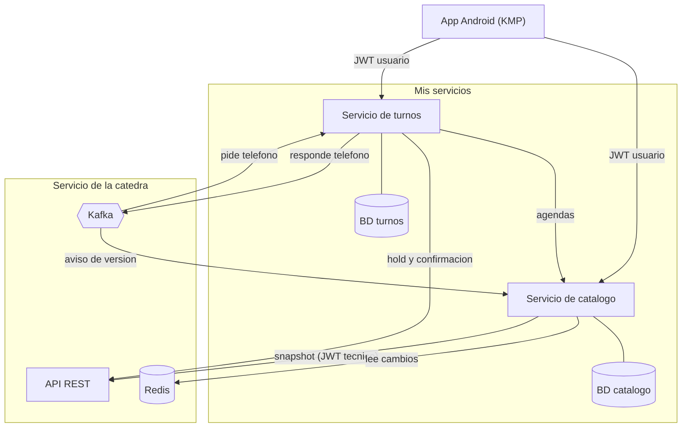
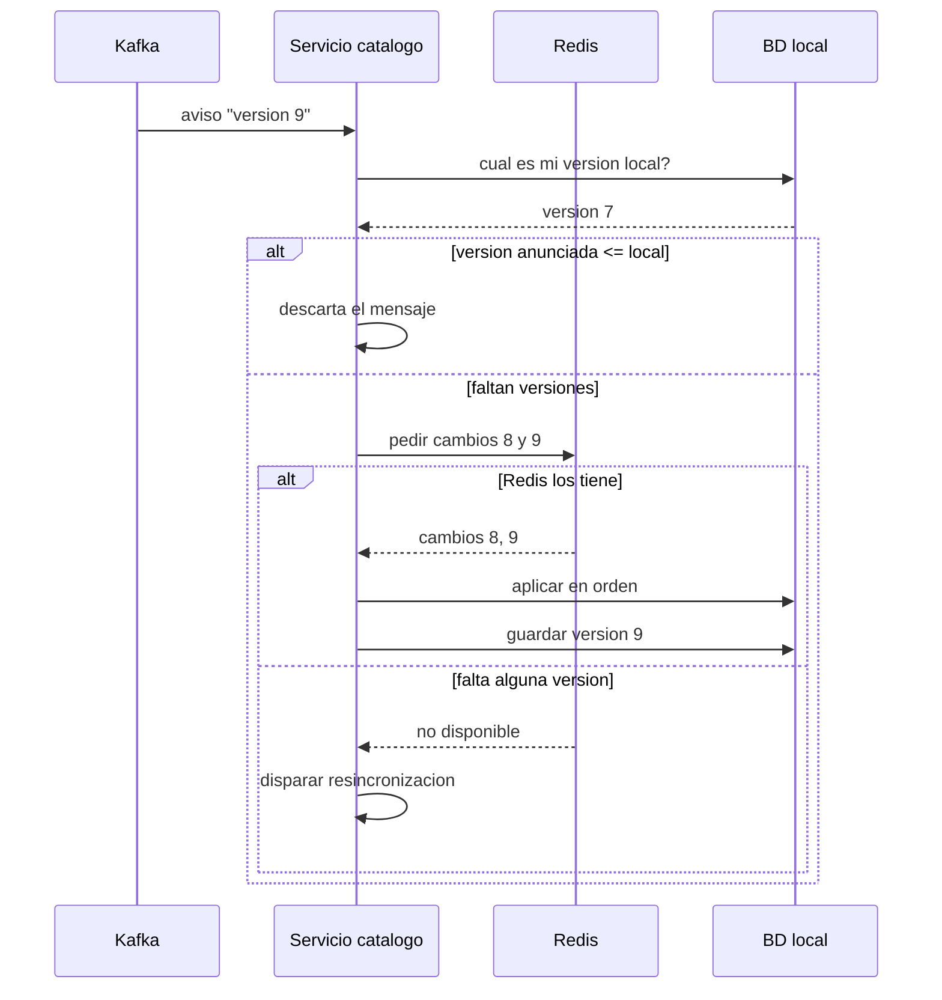
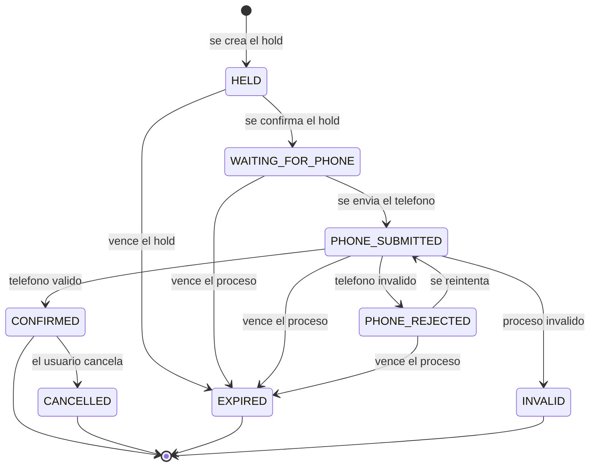

# Arquitectura del sistema

## Vista general

```mermaid
graph TB
    APP["App Android (KMP)"]

    subgraph propio["Mis servicios"]
        CAT["Servicio de catalogo"]
        TUR["Servicio de turnos"]
        BDC[("BD catalogo")]
        BDT[("BD turnos")]
        CAT --- BDC
        TUR --- BDT
    end

    subgraph catedra["Servicio de la catedra"]
        API["API REST"]
        REDIS[("Redis")]
        KAFKA{{"Kafka"}}
    end

    APP -->|"JWT usuario"| CAT
    APP -->|"JWT usuario"| TUR
    TUR -->|"agendas"| CAT

    CAT -->|"snapshot (JWT tecnico)"| API
    CAT -->|"lee cambios"| REDIS
    KAFKA -->|"aviso de version"| CAT

    TUR -->|"hold y confirmacion"| API
    KAFKA -->|"pide telefono"| TUR
    TUR -->|"responde telefono"| KAFKA
```

## Sincronizacion incremental del catalogo

```mermaid
sequenceDiagram
    participant K as Kafka
    participant S as Servicio catalogo
    participant R as Redis
    participant BD as BD local

    K->>S: aviso "version 9"
    S->>BD: cual es mi version local?
    BD-->>S: version 7

    alt version anunciada <= local
        S->>S: descarta el mensaje
    else faltan versiones
        S->>R: pedir cambios 8 y 9
        alt Redis los tiene
            R-->>S: cambios 8, 9
            S->>BD: aplicar en orden
            S->>BD: guardar version 9
        else falta alguna version
            R-->>S: no disponible
            S->>S: disparar resincronizacion
        end
    end
```

## Maquina de estados de la reserva

```mermaid
stateDiagram-v2
    [*] --> HELD: se crea el hold

    HELD --> WAITING_FOR_PHONE: se confirma el hold
    HELD --> EXPIRED: vence el hold

    WAITING_FOR_PHONE --> PHONE_SUBMITTED: se envia el telefono
    WAITING_FOR_PHONE --> EXPIRED: vence el proceso

    PHONE_SUBMITTED --> CONFIRMED: telefono valido
    PHONE_SUBMITTED --> PHONE_REJECTED: telefono invalido
    PHONE_SUBMITTED --> EXPIRED: vence el proceso
    PHONE_SUBMITTED --> INVALID: proceso invalido

    PHONE_REJECTED --> PHONE_SUBMITTED: se reintenta
    PHONE_REJECTED --> EXPIRED: vence el proceso

    CONFIRMED --> CANCELLED: el usuario cancela

    CONFIRMED --> [*]
    CANCELLED --> [*]
    EXPIRED --> [*]
    INVALID --> [*]
```
